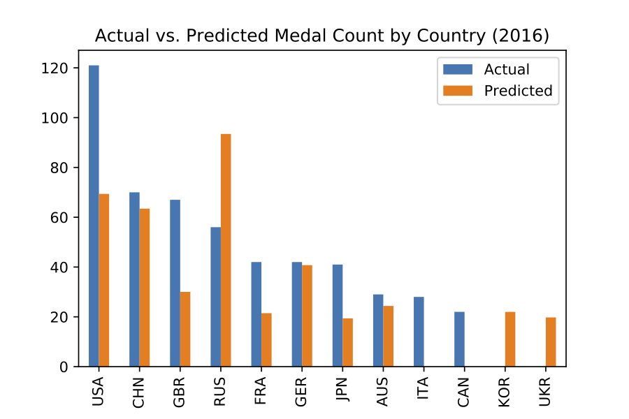
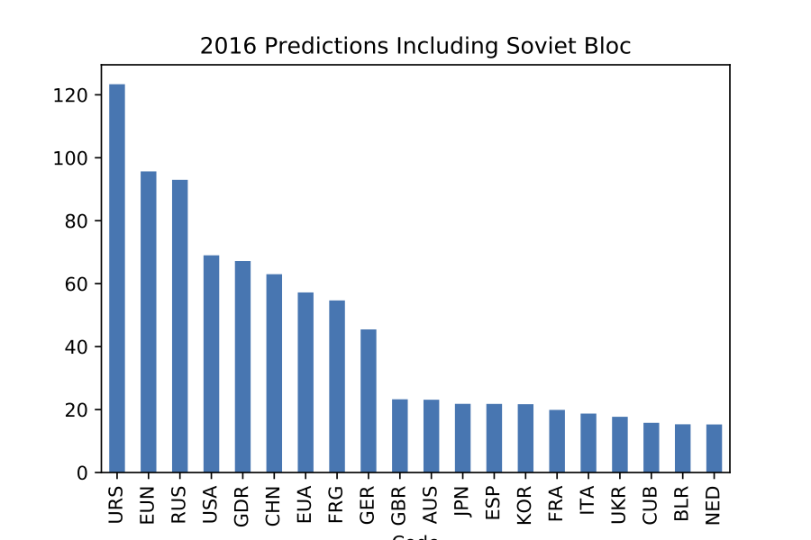
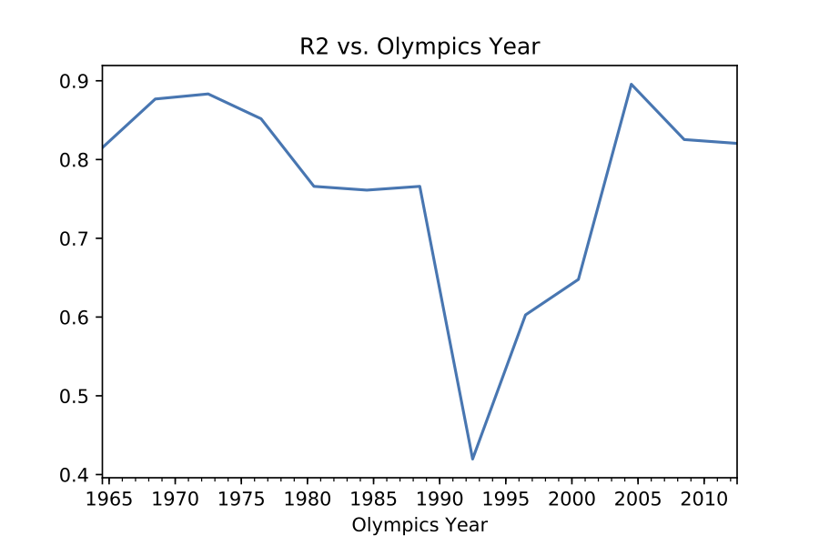
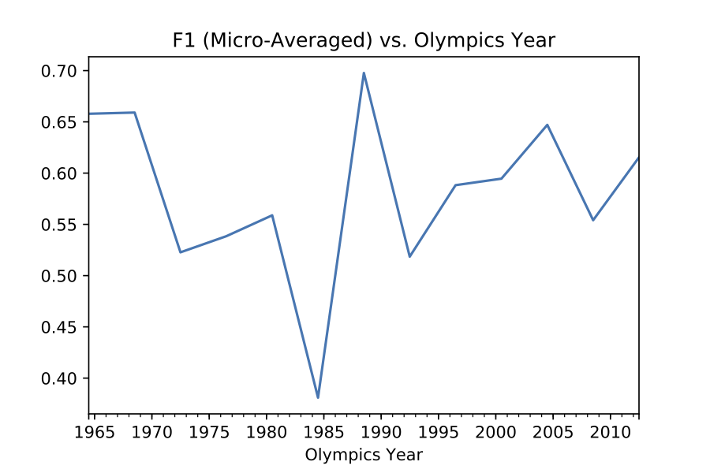
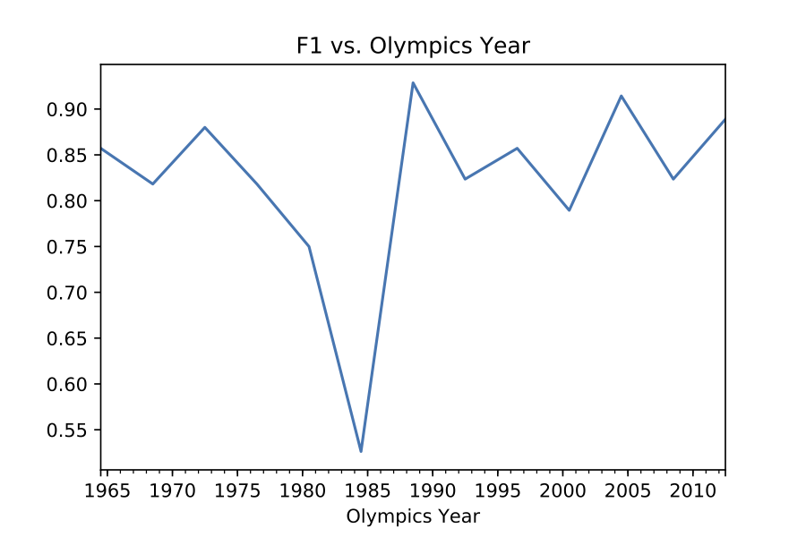
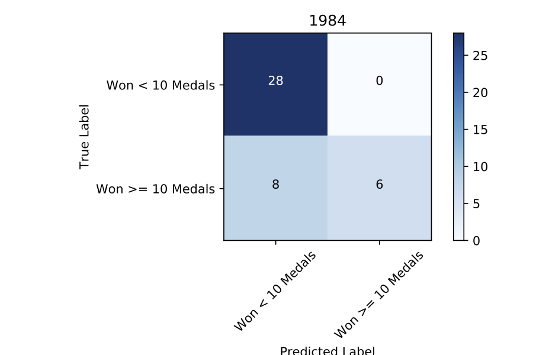
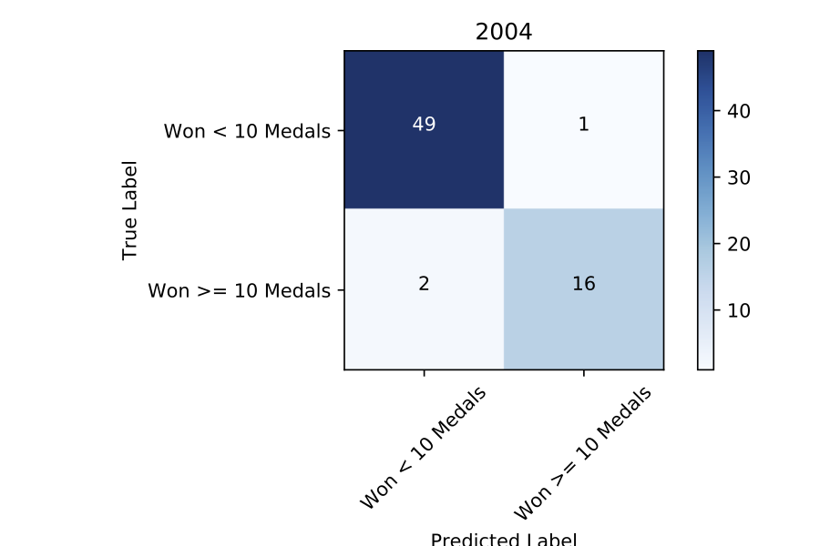

# Investigating Medals as the Olympic Games using Featuretools
##### [Goals](##goals) | [Installation](##installation) | [Featuretools Basics](##featuretools) | [Baselines using Featuretools](##baselines)

<!--| [Generating Labels](##[Coming soon] Generating Labels (Prediction Engineering))
| [Deeper Exploration](#[Coming soon] Deeper Exploration)
| [Linking Multiple Datasets](#[Coming soon] Linking Multiple Datasets)
| [Performance Evaluation](#[Coming soon] Performance Evaluation)
| [Constrained Feature Exploration](#[Coming soon] Constrained Feature Exploration)
-->
## Highlights

I'll show how to build a model that predicts which country is going to win the Olympic Games.

This is how we stack up in 2016 (the dataset included data from 1896-2012):



This is what the model predicts would have happened in 2016 had the Soviet bloc countries competed:



We see the Soviet Union (URS) winning it all, and both East (GDR) and West (FRG) Germany beating modern unified Germany (GER).

The model is surprisingly good, even with the simple baseline features I constructed. Check out the following scores over time:

**Regression model**


**Binned model**


**Binary model**


Notice how much worse we do in some years! We can easily see the impact of various world affairs that happened outside of this dataset, such as the Cold War boycotts in the 1980s.

Here are 2 confusion matrices from 1984 and 2004, showing much worse we are predicting which were high-scoring countries in 2004.





Sampling of high-level features (defined automatically using Featuretools) that mattered a lot:

**`PERCENTILE(COUNT(medals_won WHERE Medal = Gold))`**: Percentile across all countries of the count of gold medals won in all previous Olympics.

**`MEAN(countries_at_olympic_games.PERCENTILE(NUM_UNIQUE(medals_won.MODE(medaling_athletes.Athlete))))`** Convoluted way of saying take the number of unique medaling athletes at each olympics a country competed in, find the percentile of that number in relation to the other countries, and take the average percentile over time. In other words, the average rank of the number of medaling athletes over time. The Mode part is an overcomplication that does not provide any additional information. So, if this value was high, it means that the country had on average a lot of medaling athletes in its historical Olympic showings.

**`TREND(countries_at_olympic_games.SKEW(medals_won.NUM_UNIQUE(medaling_athletes.Athlete)), Year)`** The way we have out data set up, each medal can be associated with many athletes (think: all the members of the medaling Soccer team). Therefore, this feature is looking at the skew (a statistical measure indicating whether more of the values lie toward the left or the right of the mean) of how many athletes there were per medal, and finding the the slope of a trend line fitted these skew numbers over time. One way to think of the skew number is whether the country won more medals in team sports than in individual sports, and the trend shows how that changes over time.

## Goals

The various notebooks provided in this repo show how Featuretools:

[Featuretools](https://www.featuretools.com/) is a framework to perform automated feature engineering. It excels at transforming transactional and relational datasets into feature matrices for machine learning.

The notebooks here show how Featuretools:
 * Simplifies data science-related code ([this](BaselineSolutions.ipynb))
 * Enables us to ask innovative questions ([this](FeaturetoolsPredictiveModelingSimple.ipynb))
 * Avoid classic label-leakage problems ([this](FeaturetoolsPredictiveModelingSimple.ipynb))
 * Exhaustively generate thousands of features ([this](FeaturetoolsPredictiveModelingSimple.ipynb))
 * Easily combine separate dataset into joint models (Coming soon)

We do so by investigating the medals won by each country at each historical Olympic Games (dataset pulled from [Kaggle](kaggle.com/the-guardian/olympic-games)).

The dataset contains each medal won at each Olympic Games, including the medaling athlete, his or her gender, and his or her country and sport.

I'll generate a model using Featuretools that predicts the number of medals a country will win at the next Olympics, compare it to 2 baseline solutions without Featuretools, and provide analysis of various predictive factors.

## Installation

```sh
pip install -r requirements.txt
```

The Olympic Games dataset is found <a href=https://www.kaggle.com/the-guardian/data>here</a>.

<!--Notebooks 4, 5 and 6 will require the following additional datasets:-->

<!-- * <a href=https://www.kaggle.com/worldbank/world-development-indicators>Economic Data</a> -->
<!-- * <a href=https://unstats.un.org/unsd/methodology/m49/overview/>Region Data</a> -->


## Detailed Description of Notebooks

#### Featuretools Basics: FeaturetoolsPredictiveModelingSimple.ipynb

In this notebook, I'll explain how to use out-of-the-box methods from Featuretools to transform the raw Olympics dataset into a machine-learning-ready feature matrix.
Along the way, I'll build some machine learning models, explore which features were the most predictive, and make some interesting predictions.

#### Baselines using Featuretools: BaselineSolutions.ipynb

Machine learning performance scores should never be taken at face value.
To have any merit, they must be compared against a simple baseline model to see how much improvement they produced.
In this notebook, I'll examine several baseline solutions, and see how much simpler the code to produce these baselines is when using Featuretools as compared to lower-level libraries.

#### [To Be Released] Generating Labels (Prediction Engineering)

I'll show a way to generate the labels for supervised machine learning we use throughout this demo.
Note that this is a non-trivial problem in general, as we need to scan through the time-varying components of a dataset and choose windows of time in which we compute a function that then determines a label.
This process is called *Prediction Engineering*, and is a core component of the paid platform of Feature Labs (the company I work for that maintains Featuretools). The open-source Featuretools does not come with built-in ways to do prediction engineering.

These labels define our goal, in this case to predict the number of medals a country will win at the next Olympics.
There are many other possible goals we could have had in mind. We could have built models to predict the number of medals an athlete will win over his or her career,
or the location of the next Olympic Games, or the sport with the highest number of competing athletes.
We stick with a single problem, which lends itself to enough complexity to make for an interesting demo. A good way to sharpen your data science skills would be to try out one of these other problems yourself.

<!--
#### [Coming soon] Deeper Exploration

Now that we understand the dataset and the basics of Featuretools, we'll take a deeper dive into some more advanced aspects of Featuretools.
Through this process we'll examine where our prediction model breaks down, as well as seek to understand the dataset from a predictive perspective.

#### [Coming soon] Linking Multiple Datasets

Linking several independently-sourced datasets is an interesting component of the data science process that Featuretools can help with.
In this notebook we'll show how to add in economic and region information about each country to our dataset, and easily rerun our pipeline with this new data.

#### [Coming soon] Performance Evaluation

At this point we've seen several different approaches to understanding the data.
In this notebook, we'll examine some unique feature selection techniques that Featuretools makes possible, as well as make some comparisons between many different models by examining their predictive power.

#### [Coming soon] Constrained Feature Exploration

The prediction problem we've defined is fairly easy to solve. What this means is that we can experiment with limited sets of features, which each hold predictive power independently from each other.
Using a limited feature set allows us to make good comparisons between different types of features.
For instance, we'll investigate how using only economic features shows us which economic indicators are most important (at least for determining the outcome of the Olympics) at different times in history.
-->
